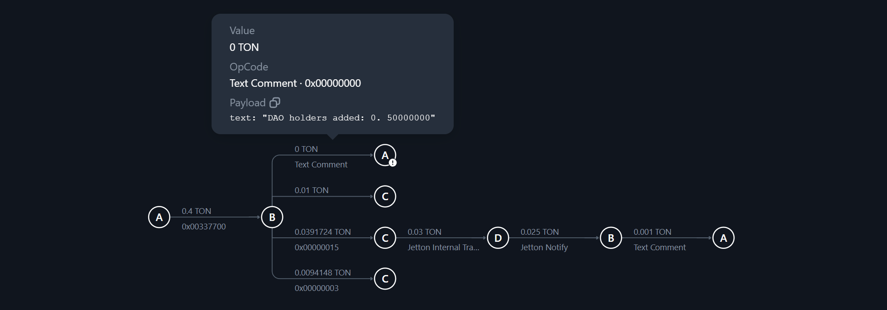
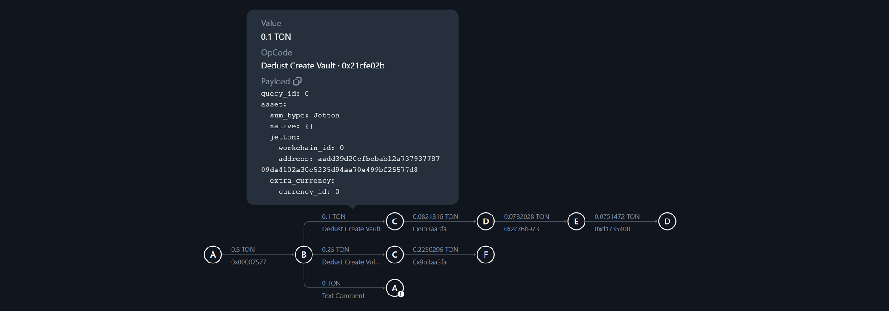
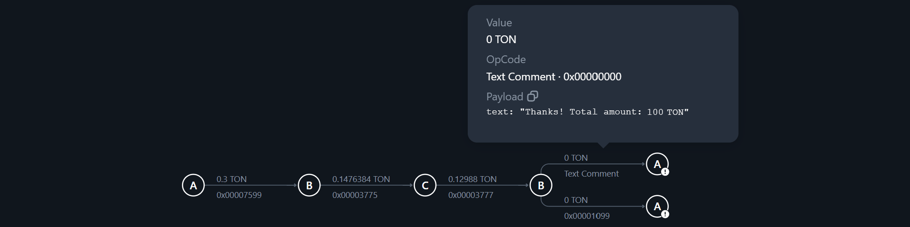
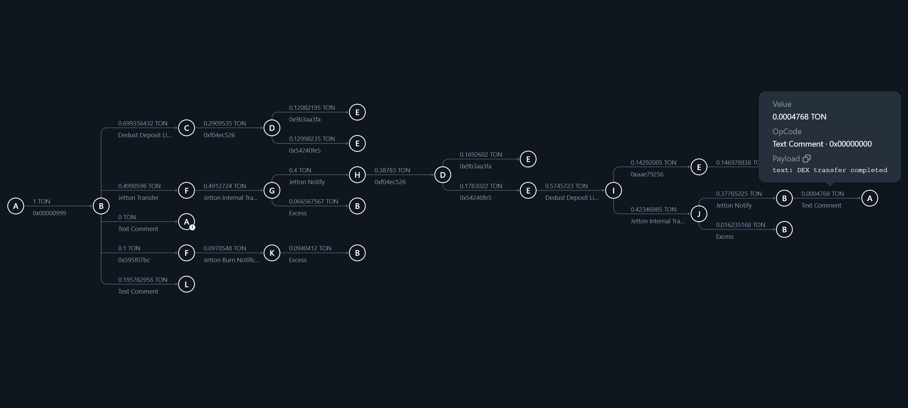

# Multix Contract

Contract for organizing **early rounds**, **presales**, **firelaunches** and token **listing on DEX**.  
**Official website**: [https://multixplatform.io](https://multixplatform.io)

## Features
1. Over 5,000 lines of code in an open source contract
2. Flexible token sale - planning and rescheduling
3. Rich unlocking options - linear and non-linear schedule
4. Automatic listing on DEX
5. Automatic burning of undistributed tokens
6. Ability to set up vesting not only on coins, but also on project funds
7. Protection against incorrect placement of coins in the DEX liquidity pool before the official listing
8. Strict validation of data added to the contract and a large number of tests
9. Optional anti-bot protection module using a digital signature of purchase transactions using the Ed25519 algorithm based on the Curve25519 elliptic curve
10. Optional DAO Veto module allows the community to initiate a refund

#### Contract deployment
Automatic creation of tokens, mint tokens and independent revocation of rights to the token. An entry for receiving coins for farming is automatically added.

#### Conduct token sales in any order
You can do a presale and after it is finished think about the date of the firelaunch. Or add a token sale, but change the date a little later. Or cancel the token sale altogether. The contract will automatically create a Vault in DeDust DEX before listing.

#### Lock DAO entries
Before adding the token seed, the DAO entries must be locked. The contract automatically protects the interests of the community and prevents common mistakes.

#### Participation in token sales, bot protection mechanism
For each participant of the token sale, a contract is created that stores information about his participation. This allows an unlimited number of participants to participate in the token sale. There is also an option that protects against bots participating in the token sale. This is implemented using a digital signature of transactions for participation in the token sale according to the Ed25519 scheme using the Curve25519 elliptic curve.

#### DEX listing, token burning
After the sale of all tokens, an automatic listing on DEX occurs. Also, a contract can be listed on DEX manually from the Multix platform control panel. When listing, a DeDust liquidity pool is created and undistributed tokens are burned.

## Technical stack
This contract is written in [Tact](https://github.com/tact-lang/tact) language for the [TON blockchain](https://github.com/ton-blockchain/ton) network.
You can find out more details on the website [TON Community](https://ton.org/).

## Security audit
Our community does everything to reduce risks and make the listing of your project as safe as possible.
We **conduct security audits** and **invite independent experts** to work together. But you should understand that working with cryptocurrency and any blockchain carries risks.

## Bug bounty programs
Our community understands how **important security** is to us. That's why we invite you to participate in our **bug and vulnerability reporting program**. If you find a serious bug in a contract that allows you to bypass existing security mechanisms, please contact us. We will fix all the comments and our community will **generously thank you**.

## Our community
We are always happy to welcome new developers to our community. If you have any ideas on how to improve the contract, please contact us. Support is available in our Telegram bot. But if you have found a technical issue, it is more appropriate to create an Issue.

## License agreement
By using this contract, you agree that you have carefully reviewed the logic of this contract and the license agreements that come with it. Modification of this contract for commercial purposes outside of our official repository is prohibited. It is important to us that, for security reasons, every modification to this contract is verified and placed only in our repository. See the licensing file for more details.